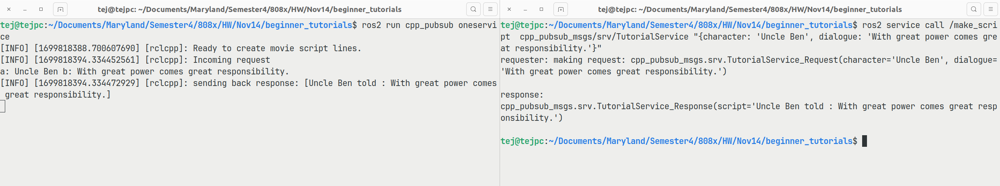
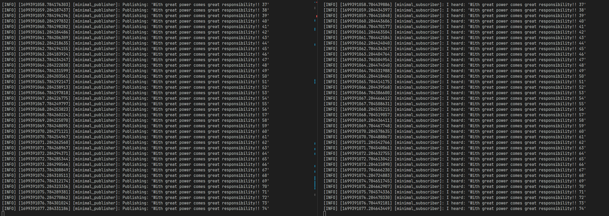
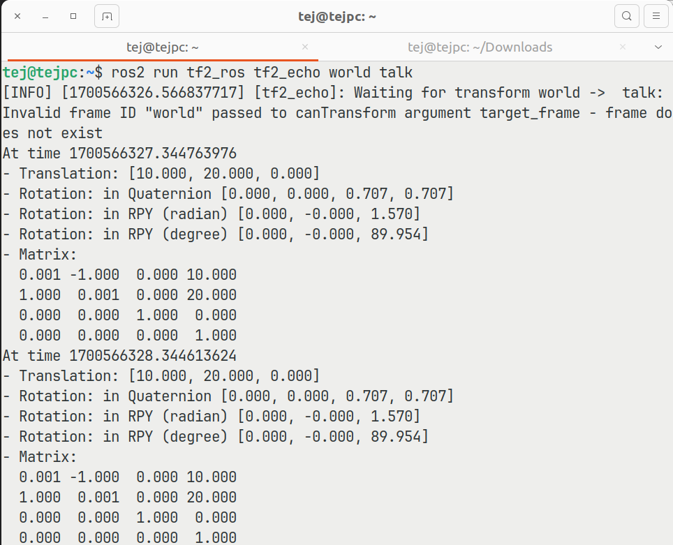
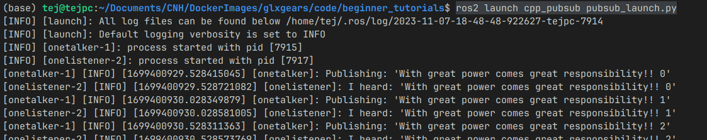
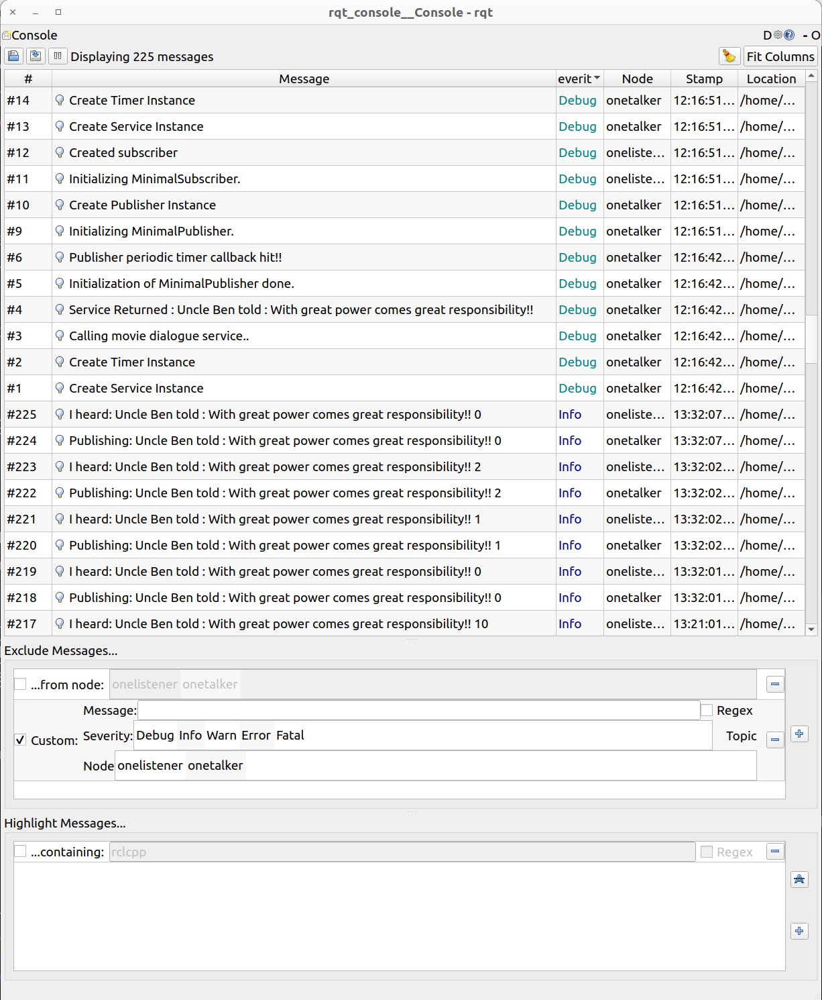

# beginner_tutorials

[](https://opensource.org/licenses/Apache-2.0)
---
# Overview:
 * This repository demostrates ROS2 publisher-subscriber and service-client functionality.
 * Two seperate packages were created. 
    - "cpp_pubsub_msgs" package containts the custome message file and the service file. 
    -  "cpp_pubsub" package contains the actual service, publisher, and subscriber nodes.

 * __Service__  :The movie script service takes in a character name and a dialogue and returns a script line by appending the two strings
 * __Publisher__: The string publisher node publishes a constant message periodically and prints to the console
    * The publisher node generates this constant message by requesting a movie script generator service with two strings (character and dialogiue) and storing the returned script line in a single string.
 * __Subscriber__: The subscriber node recieves the string and prints to the console
 * Launch file is also created which launches all the nodes at once and modifies one parameter in the client node.
 * Google Style Guide was followed in all the cpp files.
 * CPPCHECK and CPPLINT was run to perform static code analysis.
 * "results" folder contains the output of CPPCHECK and CPPLINT in a text file.
 * doxygen documentation is added to the "docs" folder inside cpp_pubsub.


## Developer:
 - Tej Kiran 
    - UID: 119197066

## Dependencies/Requirements: 
 - Laptop
 - Ubuntu 22.04 or higher
 - VS Code/Terminal
 - ROS 2 Humble

## How to build
``` bash
# Source ros environemnt
  source /opt/ros/humble/setup.bash
# Cloning the repository
  git clone --recurse-submodules <repo-link>
# cd to repository
  cd beginner_tutorials
# Compile and build the project:
  colcon build
#
```

## Instructions to run static code analysis:
 ```bash
 # Navigate to src folder in package
 cd beginner_tutorials

 # run the following command
 cppcheck --enable=all --std=c++17 ./cpp_pubsub/src/*.cpp --suppress=missingIncludeSystem --suppress=missingInclude --suppress=unmatchedSuppression > ./results/cppcheckreport

 # The report can be viewed at ./beginner_tutorials/results/cppcheckreport

 ```

## Instructions to check Google Style:
 
```bash
# Navigate to source folder
  cd beginner_tutorials

#  run the following command
 cpplint --filter=-build/c++11,+build/c++17,-build/namespaces,-build/include_order ./cpp_pubsub/src/*.cpp   > ./results/cpplintreport > ./results/cpplintreport

 # The report can be viewed at ./beginner_tutorials/results/cpplintreport
 ```

## Instructions to generate doxygen documentation:

```bash
# Navigate to doc folder in package
 cd beginner_tutorials/cpp_pubsub/doc
 
# Run the following command
 doxygen

 # To see the documentation
 cd beginner_tutorials/cpp_pubsub/doc/html
 firefox index.html
 ```


## How to run the demo
### Running individual nodes
    Individual nodes can be invoked by follwoing the below steps.
- ### Running publisher node
```bash
# Source ros environemnt
  source /opt/ros/humble/setup.bash
# Source project
  source /opt/ros/humble/setup.bash
# run talker node
  ros2 run cpp_pubsub onetalker


---------------------------------------------
# Verify tf2 tree
---------------------------------------------
# Open a second terminal window
-------------------------------
  # Source ros environemnt
    source /opt/ros/humble/setup.bash
  # Source project
    source /opt/ros/humble/setup.bash
  # view the frames over console
    ros2 run tf2_ros tf2_echo world talk
  # save frames to pdf
    ros2 run tf2_tools view_frames
```
- ### Running subscriber node
```bash
# Source ros environemnt
  source /opt/ros/humble/setup.bash
# Source project
  source /opt/ros/humble/setup.bash
# run talker node
  ros2 run cpp_pubsub onelistener
```


- ### Running service node
```bash
---------------------------------------------
# Running service node from console
---------------------------------------------
  # Source ros environemnt
    source /opt/ros/humble/setup.bash
  # Source project
   source /opt/ros/humble/setup.bash
  # run talker node
   ros2 run cpp_pubsub oneservice

---------------------------------------------
# Verify running service node from console
---------------------------------------------
# Open a second terminal window
-------------------------------
  # Source ros environemnt
    source /opt/ros/humble/setup.bash
  # Source project
    source /opt/ros/humble/setup.bash
  # rcall one service as below
    ros2 service call /make_script      cpp_pubsub_msgs/srv/TutorialService "{character: 'Uncle Ben', dialogue: 'With great power comes great responsibility.'}"
```


- ### Screenshot of the ROS2 service demostration over console


- ### Screenshot of the publisher subscriber nodes communicating over ROS2



- ### Screenshot of the ROS2 tf2 demostration over console



### Running launch file
      The service, publisher, and subscriber nodes can also be launched from the launch file using the below steps.
- ### Instructions
```bash
# Source ros environemnt
  source /opt/ros/humble/setup.bash
# Source project
  source /opt/ros/humble/setup.bash
# run talker node
  ros2 launch cpp_pubsub pubsub_launch.py
  ```
- ### Results


### Set ROS2 parameter
- ### Instructions to modify publisher rate
```bash
# To change publisher rate, use the pub_rate(units in milliseconds) launch argument as shown below
ros2 launch cpp_pubsub pubsub_launch.py log_level:='info' pub_rate:=1000
```

### Set and verfiy log level

- ### Instructions to modify log level
  By default the launch file invokes nodes with "info" log level. This can be be modied by providing the 
  "log_level" launch argument

```bash
# Pass log level as launch argument
ros2 launch cpp_pubsub pubsub_launch.py log_level:='debug'

# Allowed log_levels are as follows
#   ['info', 'debug', 'warn', 'error', 'fatal']
```
- ### Results



## Dependency Installation: 
- ROS 2 Humble:
  - Follow the below website instructions to install ROS 2 Humble based on your Ubuntu version
    - Ubuntu 22.04:
      - https://docs.ros.org/en/humble/Installation/Ubuntu-Install-Debians.html#install-ros-2-packages