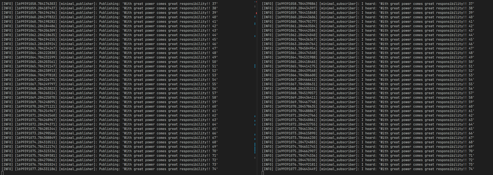

# beginner_tutorials

## Overview
### "cpp_pubsub" package demostrates the ROS2 subscriber and publisher mechanism"

### How to build
``` bash
# Source ros environemnt
  source /opt/ros/humble/setup.bash
# Cloning the repository
  git clone --recurse-submodules <repo-link>
# cd to repository
  cd beginner_tutorials
# Compile and build the project:
  colcon build
#
```
### How to run the demo
*  Running publisher node
```bash
# Source ros environemnt
  source /opt/ros/humble/setup.bash
# Source project
  source /opt/ros/humble/setup.bash
# run talker node
  ros2 run cpp_pubsub onetalker
```
*   Running subscriber node
```bash
# Source ros environemnt
  source /opt/ros/humble/setup.bash
# Source project
  source /opt/ros/humble/setup.bash
# run talker node
  ros2 run cpp_pubsub onelistener
```
### Results
